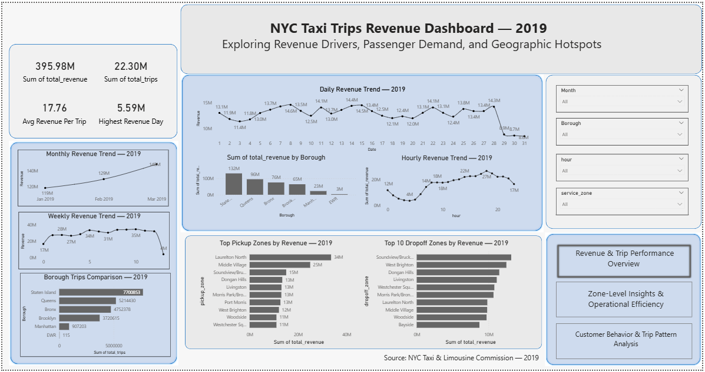
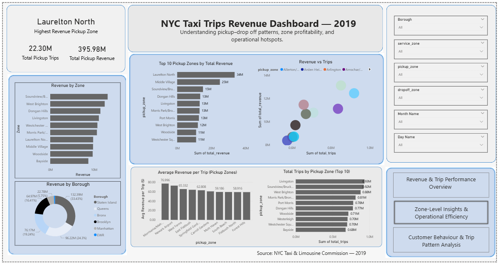
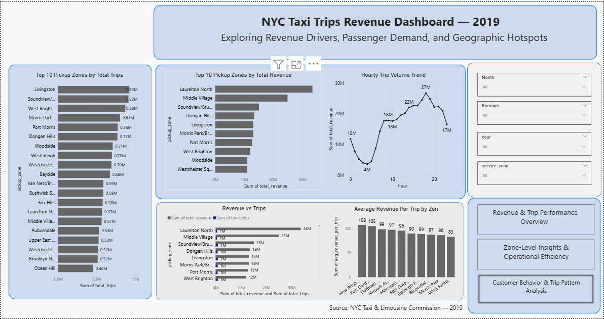

# NYC Taxi Trip Analysis (SQL + Power BI)

## Project Overview

This project analyzes **22.3 million NYC taxi trips generating ~$395.9M in revenue** using **SQL and Power BI**. The goal was to explore trip demand patterns, identify high-performing pickup zones, and understand revenue distribution across boroughs and time periods.

The analysis focuses on uncovering **operational insights that can help improve fleet allocation, pricing strategies, and service coverage.**

---

# Dataset

**Source:**
NYC Taxi & Limousine Commission (TLC)

**Records analyzed:**
22.3 Million taxi trips (2019)

**Key fields in dataset**

* Pickup & dropoff timestamps
* Passenger count
* Trip distance
* Fare amount
* Tip amount
* Total trip revenue
* Pickup & dropoff zones
* Payment type

The dataset represents one of the largest publicly available urban mobility datasets.

---

# Tools & Technologies

* **SQL (MySQL)** – data cleaning, transformation, and analysis
* **Power BI** – dashboard development and visualization
* **Data Modeling** – relational joins between trip and location datasets
* **Exploratory Data Analysis (EDA)**

---

# Key Analyses Performed

## 1. Trip Demand Analysis

* Hourly trip distribution
* Peak demand hours
* Trip volume by borough
* Pickup vs dropoff patterns

## 2. Revenue Analysis

* Total revenue breakdown
* Revenue per trip
* Revenue per mile
* Revenue per borough
* Revenue by pickup zones

## 3. Location Intelligence

* Top pickup zones by revenue
* Top dropoff zones by trip volume
* Pickup → Dropoff flow analysis
* Borough-level demand distribution

## 4. Customer Behavior

* Passenger count distribution
* Tip contribution to total revenue
* Ride duration segmentation

---

# Key Insights

* The dataset contains **22.3M trips generating ~$395.9M revenue**.
* **Staten Island and Queens contribute the highest number of pickup trips.**
* A small number of zones generate **disproportionately high revenue**, indicating strong demand clusters.
* Taxi demand peaks during **morning commute and evening hours**, reflecting work travel patterns.
* Some zones generate **high trip volume but lower revenue per trip**, suggesting shorter urban rides.

---

# Dashboard Overview

The Power BI dashboard consists of **three analytical pages**.

---

## 1. Revenue & Trip Performance Overview

This page provides a high-level summary of taxi operations including:

* Total revenue generated
* Total trips completed
* Average trip distance
* Hourly trip demand patterns
* Revenue contribution by borough



---

## 2. Zone-Level Insights & Operational Efficiency

This page focuses on geographic performance and operational patterns.

* Top pickup zones by revenue
* Trip volume by pickup zones
* Revenue vs trip volume comparisons
* Identification of high-demand zones




---

## 3. Customer Behavior & Trip Patterns

This page analyzes rider behavior and trip characteristics.

* Passenger count distribution
* Trip distance patterns
* Tip contribution to revenue
* Customer ride behavior trends




---

# Repository Structure

```
nyc-taxi-sql-analysis
│
├── dataset
│   └── dataset_info.txt
│
├── sql
│   └── nyc_taxi_analysis.sql
│
├── dashboard
│   └── nyc_taxi_dashboard.pbix
│
├── screenshots
│   ├── dashboard_page1.png
│   ├── dashboard_page2.png
│   └── dashboard_page3.png
│
└── README.md
```

---

# Skills Demonstrated

* SQL data analysis on a large-scale datasets
* Data modeling and relational joins
* Exploratory data analysis
* Dashboard design in Power BI
* Translating raw data into business insights

---

# Author

**Ashwin Shende**
---

# Dataset Source

NYC Taxi & Limousine Commission
[https://www.nyc.gov/site/tlc/about/tlc-trip-record-data.page](https://www.nyc.gov/site/tlc/about/tlc-trip-record-data.page)

---


---

If you want, I can also give you **one small addition (a “Project Architecture” section) that makes the repo look like a senior data analyst project instead of a beginner one.**
